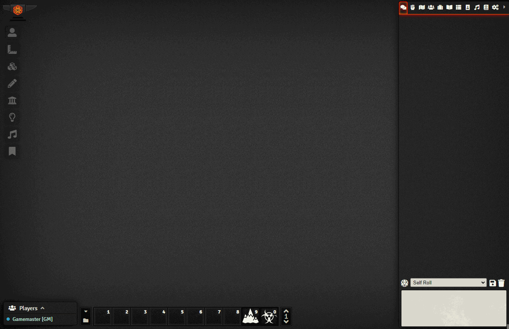
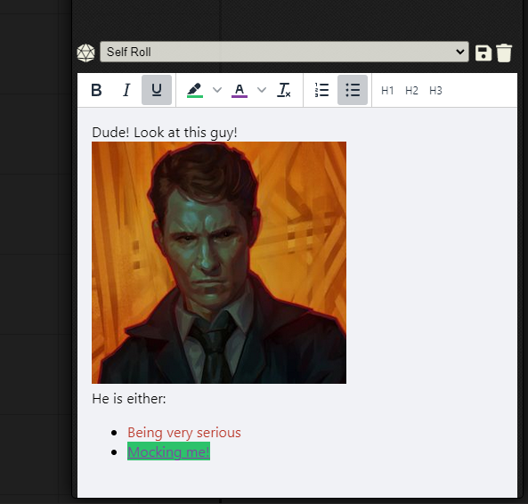

   
# Sidebar Resizer and Chat Editor
Allows users to resize the sidebar of Foundry VTT, including the Chat Popout.

Adds the possibility of Formatting the Chat with a rich editor (Experimental). The formatter is disabled by default.

Hover over the edge of the sidebar or the top of the chat, and a resize cursor should appear, drag to the size you prefer. Will remember the size, individual to the computer you are using.

Originally created by VanceCole - Revived, improved, supported and maintained by @JeansenVaars

### _By JeansenVaars_ - [Invite me to a Coffee](https://ko-fi.com/jeansenvaars) :) if you enjoy this module!

Check it out along my other modules [Minimal UI](https://github.com/saif-ellafi/foundryvtt-minimal-ui) and [Window Controls](https://github.com/saif-ellafi/foundryvtt-window-controls)
#### [This module was made for free, with joy, long nights and because of hundred windows needed it, so tons of coffee :D!](https://ko-fi.com/jeansenvaars)

# Compatibility issues?
I work on this module based on my personal preferences, and of course share it with others because I love doing so!

Having said that, I only use a small limited subset of modules myself, and making modules work with others out there takes work, 
which I am usually honestly not motivated to do. Do consider inviting me a Coffee and let me know which one doesn't work for you, I'll be more inspired afterwards :)

Do track the issue however, it is good that it is not forgotten, or of course feel welcome to submit a pull request that makes it work and I'll happily accept it and give credits.

# License

[MIT License](./LICENSE.md)

# Powered By

Thanks to JetBrains I can work on this project using **WebStorm**.
