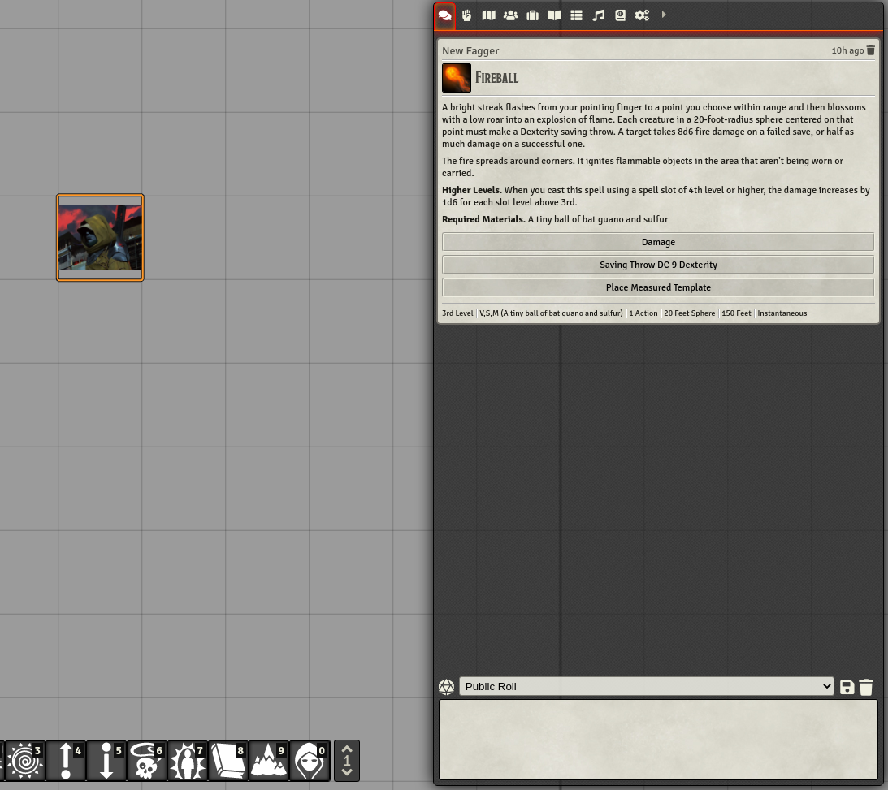

   
# Sidebar Resizer
Allows users to resize the sidebar of Foundry VTT. Good for 4k screens or solo/PBP players.

Simply hover over the edge of the sidebar and a resize cursor should appear, drag to the size you prefer. Will remember the size, individual to the computer you are using.

Originally created by VanceCole - Revived, improved, supported and maintained by @JeansenVaars

## [Invite me a coffee if you like this :D](https://ko-fi.com/jeansenvaars)

# Module & System Incompatibilities
Certain modules or systems may be incompatible with this module if they specify an !important flag on the width of the sidebar, in such cases please ping me on discord @JeansenVaars

# License

[MIT License](./LICENSE.md)

# Powered By

Thanks to JetBrains I can work on this project using **WebStorm**.
