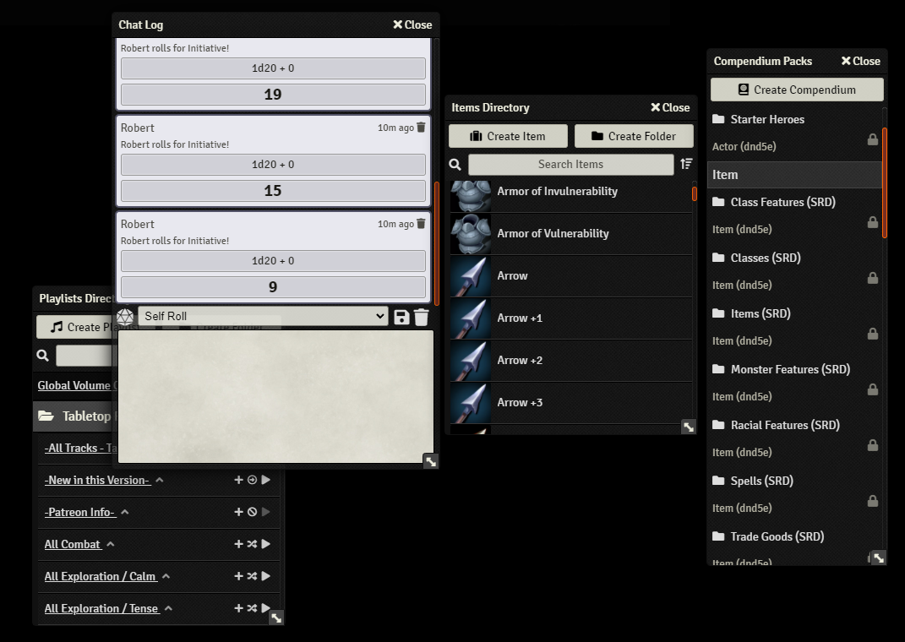

   
# Sidebar Resizer and Chat Editor

* Resize the sidebar horizontally
* Resize the chat text area vertically
* Resize any sidebar floating windows (Combat Tracker, Playlist, etc.)
* Enable an advanced rich editor to the chat (Disabled by default)

For resizing the Sidebar and the Chat, hover the mouse over the borders and drag and drop. Size will be remembered.

_Originally created by VanceCole - Revived, improved and maintained by @JeansenVaars_

### _By JeansenVaars_ - [Invite me to a Coffee](https://ko-fi.com/jeansenvaars) :) if you enjoy this module!

Check it out along my other modules [Minimal UI](https://github.com/saif-ellafi/foundryvtt-minimal-ui) and [Window Controls](https://github.com/saif-ellafi/foundryvtt-window-controls)
#### [This module was made for free, with joy, long nights and because of hundred windows needed it, so tons of coffee :D!](https://ko-fi.com/jeansenvaars)

### Chat Text Area Resizer 

### Resize any Sidebar floating Windows

### Rich editor for Text Area

# Compatibility issues?
I work on this module based on my personal preferences, and of course share it with others because I love doing so!

Having said that, I only use a small limited subset of modules myself, and making modules work with others out there takes work, 
which I am usually honestly not motivated to do. Do consider inviting me a Coffee and let me know which one doesn't work for you, I'll be more inspired afterwards :)

Do track the issue however, it is good that it is not forgotten, or of course feel welcome to submit a pull request that makes it work and I'll happily accept it and give credits.

# License

[MIT License](./LICENSE.md)

# Powered By

Thanks to JetBrains I can work on this project using **WebStorm**.
